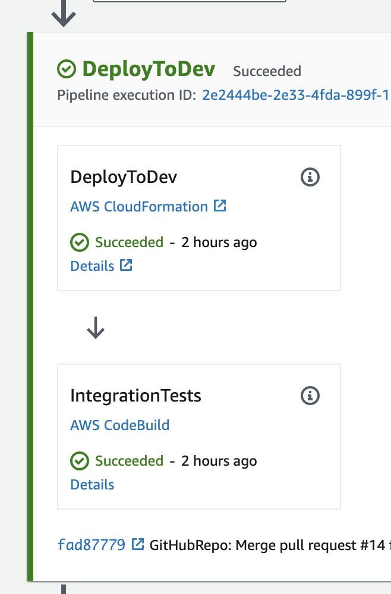
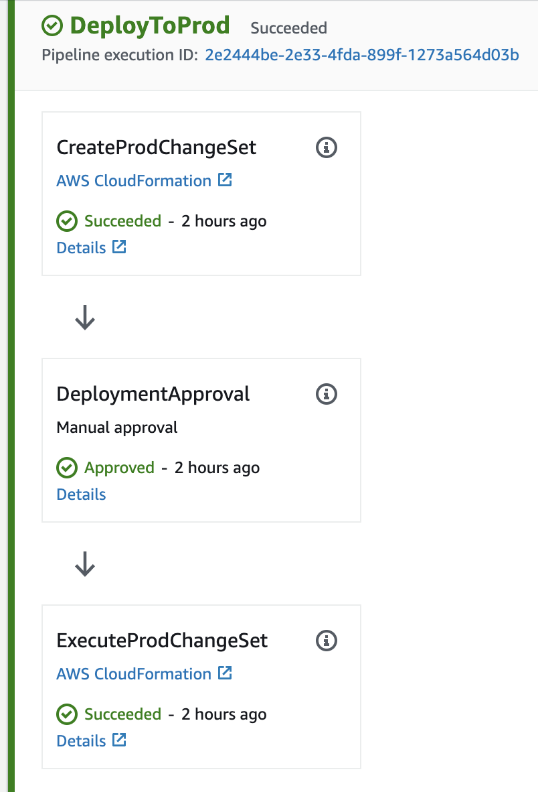

# AWSCodePipelineExample

This is a non-trivial example of how a Cross-Account CodePipeline should work based on my blog post [AWS CI/CD Tooling](https://purple.telstra.com/blog/aws-ci-cd-tooling). This project requires at least 3 separate AWS accounts.

1. Build Account - This is where the CodePipeline will be deployed and run (it can be the AWS Organization account, but should probably be a dedicated build account in a real project).
1. Dev Account - This is where the first stage of the pipeline will deploy to, and run an initial suite of integration tests
1. Production Account - This is where the second stage of the deployment will deploy to and run sanity tests.

In order for this example to run, the infrastructure must be set up in the following order:

1. The Build Account base infrastructure must be provisioned by executing `BuildAccountBaseInfrastructure.yml` cloudformation script in the Build Account
1. The dev and prod deployment roles need to be provisioned by executing the `CrossAccountCFNRole.yml` cloudformation script, and passing in the arn of the KMS key provisioned in the previous step
1. The CodePipeline can then be provisioned using the `CodePipeline.yml` again passing in the arn of the KMS key to use for artefact encryption which was provisioned as part of the build account base infratructure

This project uses conventions based on ProjectName in order to minimize the number of parameters required to pass to the respective cloudformation templates. For example, the codepipeline assumes
that there are roles named `${ProjectName}-${AWS::Region}-DeploymentRole` in both the prod and dev accounts, rather than passing explicit arns in. These roles are set up by the cloudformation scripts as described above.

## Features

### C# .Net to the Core

As a passionate C# developer, I'm always a little jealous of the plethora of NodeJs and Python examples out there. While it's obvious that AWS are willing to invest time and energy in the .Net tool stack, and have reasonably good support for it, there is a serious derth of well structured and thought through examples. This means most of the time .Net developers are left trying to translate code from Python or NodeJs. This example contains C# and Powershell Core. There is a tiny bit of Bash, but that's because it's the only shell supported for CodeBuild, and even then, for anything complex, I've called a powershell script from bash.

### Cross Account CodePipeline

This pipeline demosntrates deploying a serverless .Net core application in a secure CrossAccount manner. Cross Account roles are set up in the dev and prod accounts, and provide the permissions for the pipeline to deploy the
cloudformation script.

### Integration Tests

The integration tests execute against the dev environment after it has been deployed by passing in the API Gateway endpoint as an environment variable to the "IntegrationTests" action.
If these tests fail, the pipeline will not continue onto prod.

### Manual Approval Gate

 Manual Approval Gate is added to the Production Deployment. This Approval Gate sits between the "CreateProdChangeSet" and "ExecuteProdChangeSet" actions. This allows for two things to occur:

 1. Manual/UAT testing to be completed in the Dev environment, and
 1. A manual inspection of the Changeset that is being proposed for the Prod environment.

While ideally as much testing as possible should be automated, full automation may not be achievable in reality. Being able to inspect the changeset may give the business confidence regarding the safety of the change from an infrastructure standpoint.

### Lambda Version Deployment

In the application stack, the lambda function is deployed using an "AutoPublishAlias". This is a [special construct in the SAM template](https://docs.aws.amazon.com/serverless-application-model/latest/developerguide/automating-updates-to-serverless-apps.html) that instructs the template to use CodeDeploy under the hood to expose a number of different deployment strategies. In this example, I use `AllAtOnce` for deploying to the Dev environment, and then `Linear10PercentEvery1Minute` in Prod. This allows me to hook up automated rollback based on a cloudwatch alarm that is triggered on API Errors.

### Pre & Post Traffic Lifecycle Event Hooks

Using CodeDeploy as described above, also allows me to wire up Pre and Post traffic lifecycle event hooks. These are basically Lambda functions that are called at the lifecycle points suggested in the name. Currently they don't really do anything, but could easily be used to test assumptions, trigger some load tests, etc.... The key here is that although I return a success from the Lambda immediately, the pipeline will not continue unless the callback is called, so it is completely feasible to invoke a step function to coordinate a suite of tests, and then based on the test results, callback with either a success or failure result. If a failure result is returned, the pipeline will be halted and the deployment rolled back.

## Roadmap and Contributing

I would really like to continue adding to this example to demonstrate the various techniques. I am also open to Pull Requests or for people to raise issues. Please let me know if there's anything you'd like to see. I have a few ideas myself.

### Future feature

* Some realistic tests kicked off using the Post Traffic Lifecycle Event Hook.
* An example showing more than 1 lambda function

If you have any other ideas, hit me up by creating an issue.
